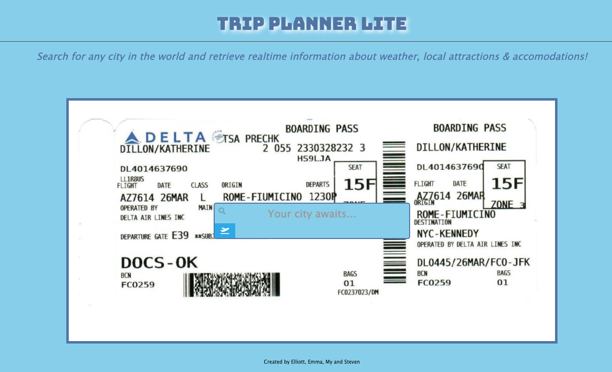
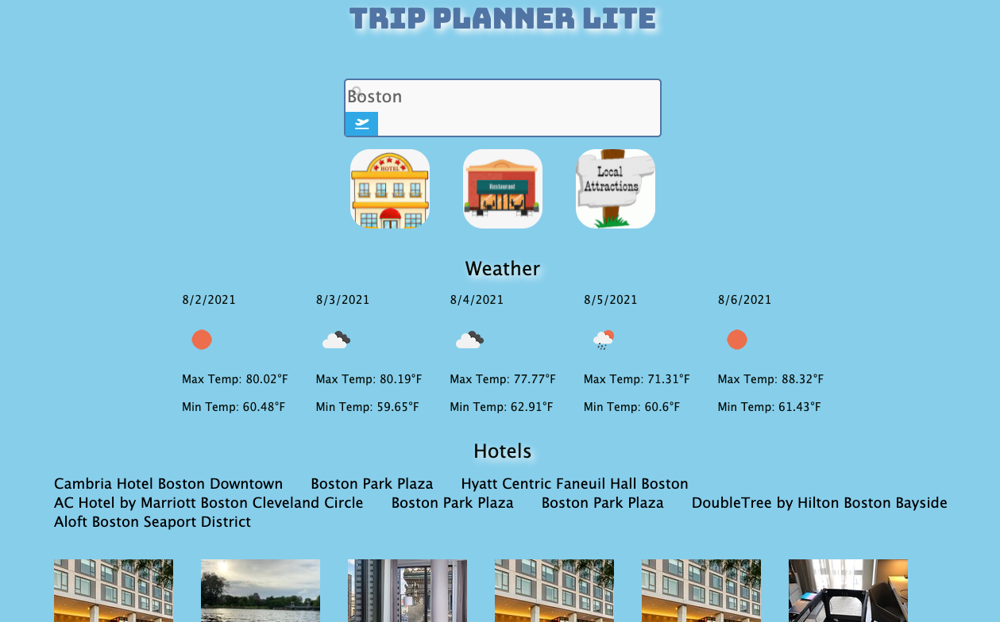

# Group Project 1 - Trip Planner Lite
By Steven Chung, Elliott Spencer, My Ly, Emma Graham

## Your Task
For our first group project of the course, we were required to conceive of and execute a design that solves a real-world problem by integrating data received from multiple server-side API requests. Our group decided to create a Travel Planner application that would allow users to input the name of their destination (any city in the world!). After submitting a city, users will be presented with the weather at their destination over the next 5 days. They will also be able to see popular hotels, restaurants and attractions near their destination. This application will help users plan upcoming trips. The weather, hotels, restaurants and attractions info are provided by two APIS: Rapid API Weather API & Rapid API Travel Advisor API.

## Built With

* [Moment JS](https://momentjs.com/))

## Deployed Link

* [See Live Site](https://egraham96.github.io/group-project-1/)
* [Link to GitHub Repo](https://github.com/egraham96/group-project-1)

## Preview of Working Site




## Code Snippet
This a code snippet using jquery...........

```javascript
 //function for list of hotels in CITY
function hotelAdvisor(latitude, longitude) {

    fetch("https://travel-advisor.p.rapidapi.com/hotels/list-by-latlng?latitude=" + latitude + "&longitude=" + longitude + "&lang=en_US&hotel_class=3&limit=25&adults=2&amenities=bar_lounge&rooms=1&currency=USD&subcategory=hotel%2Cbb&nights=5", {
            "method": "GET",
            "headers": {
                "x-rapidapi-key": "b519689459msheabfb47c1ca1bb2p18f9bcjsne0e023037538",
                "x-rapidapi-host": "travel-advisor.p.rapidapi.com"
            }
        })
        .then(response => response.json())
        .then((data) => {
            console.log(data);
            var hotelLocationID = [];
            var hotelNameArray = [];

            for (i = 0; i < data.data.length; i++) {
                var hotelID = data.data[i].location_id;
                var hotelName = data.data[i].name;
                hotelLocationID.push(hotelID);
                hotelNameArray.push(hotelName);
            }
            console.log(hotelLocationID);
            console.log(hotelNameArray);
            //for loop function to get the images and names and add them to the html.
            hotelPhotos(hotelLocationID, hotelNameArray);
        })
        .catch(err => {
            console.error(err);
        });
}
```